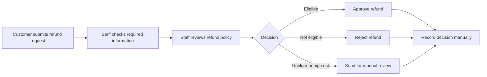
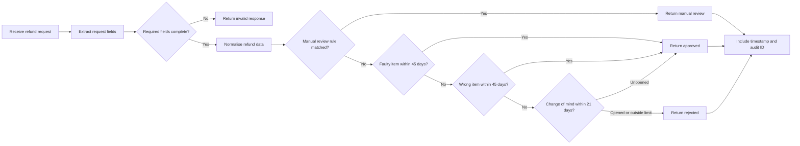

# Refund Decision Workflow

## Process maps

### Before automation

```mermaid
flowchart LR
    A[Customer submits refund request] --> B[Staff checks required information]
    B --> C[Staff reviews refund policy]
    C --> D{Decision}
    D -->|Eligible| E[Approve refund]
    D -->|Not eligible| F[Reject refund]
    D -->|Unclear or high risk| G[Send for manual review]
    E --> H[Record decision manually]
    F --> H
    G --> H
```

### After automation

```mermaid
flowchart LR
    A[Receive refund request] --> B[Extract request fields]
    B --> C{Required fields complete?}

    C -->|No| D[Return invalid response]
    C -->|Yes| E[Normalise refund data]

    E --> F{Manual review rule matched?}
    F -->|Yes| G[Return manual review]

    F -->|No| H{Faulty item within 45 days?}
    H -->|Yes| I[Return approved]

    H -->|No| J{Wrong item within 45 days?}
    J -->|Yes| I

    J -->|No| K{Change of mind within 21 days?}
    K -->|Unopened| I
    K -->|Opened or outside limit| L[Return rejected]

    I --> M[Include timestamp and audit ID]
    G --> M
    L --> M
```
