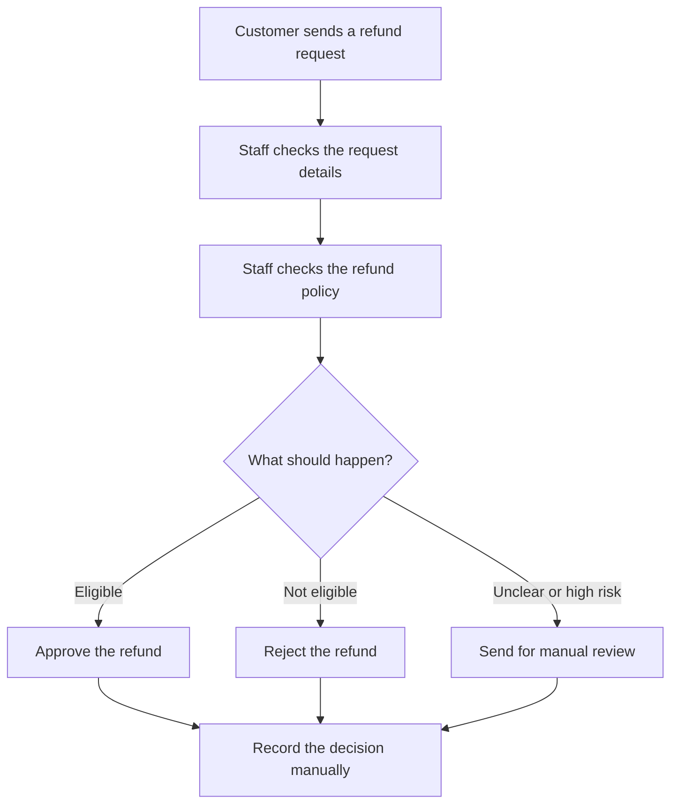
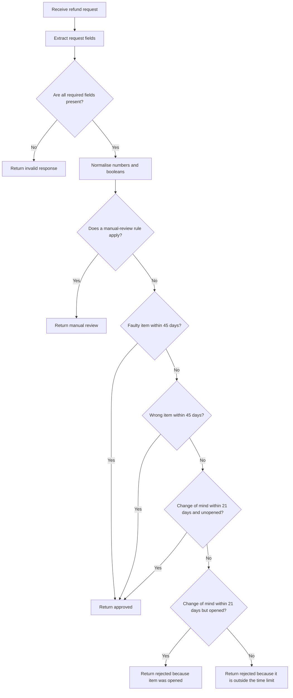

## Process Maps

### Before Automation

```mermaid
flowchart TD
    customerRequest[Customer sends a refund request]
    staffCheck[Staff checks the request details]
    staffPolicy[Staff checks the refund policy]
    staffDecision{What should happen?}
    approveRefund[Approve the refund]
    rejectRefund[Reject the refund]
    manualReview[Send for manual review]
    recordDecision[Record the decision manually]

    customerRequest --> staffCheck
    staffCheck --> staffPolicy
    staffPolicy --> staffDecision

    staffDecision -->|Eligible| approveRefund
    staffDecision -->|Not eligible| rejectRefund
    staffDecision -->|Unclear or high risk| manualReview

    approveRefund --> recordDecision
    rejectRefund --> recordDecision
    manualReview --> recordDecision
```

### After Automation

```mermaid
flowchart TD
    receiveRequest[Receive refund request]
    extractFields[Extract request fields]
    requiredFields{Are all required fields present?}
    invalidResponse[Return invalid response]
    normaliseData[Normalise numbers and booleans]

    manualRule{Does a manual-review rule apply?}
    manualResponse[Return manual review]

    faultyRule{Faulty item within 45 days?}
    wrongItemRule{Wrong item within 45 days?}
    changeMindRule{Change of mind within 21 days and unopened?}
    openedRule{Change of mind within 21 days but opened?}

    approvedResponse[Return approved]
    openedRejection[Return rejected because item was opened]
    timeLimitRejection[Return rejected because it is outside the time limit]

    receiveRequest --> extractFields
    extractFields --> requiredFields

    requiredFields -->|No| invalidResponse
    requiredFields -->|Yes| normaliseData

    normaliseData --> manualRule
    manualRule -->|Yes| manualResponse
    manualRule -->|No| faultyRule

    faultyRule -->|Yes| approvedResponse
    faultyRule -->|No| wrongItemRule

    wrongItemRule -->|Yes| approvedResponse
    wrongItemRule -->|No| changeMindRule

    changeMindRule -->|Yes| approvedResponse
    changeMindRule -->|No| openedRule

    openedRule -->|Yes| openedRejection
    openedRule -->|No| timeLimitRejection
```
